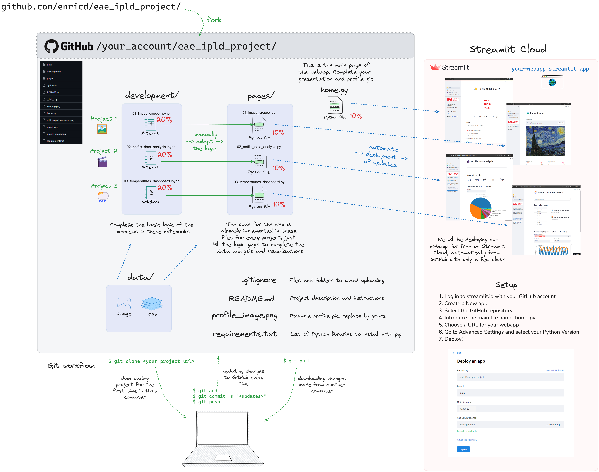

<div align="center">

# EAE - Master In Big Data & Analytics

## Subject: Introduction to Programming Languages for Data - Final Project


### Author: *Your Name Here*

### Date: Dec 2023

### Instructor: Enric Domingo - [/enricd](https://github.com/enricd)

</div>

---



- The deployed web app of this specific repository with its current uncompleted state (exercises to be done): https://eae-ipld-project.streamlit.app/
  
- A demo of a finished version of this project: https://eae-ipld-demo.streamlit.app/

## 0. Project Description

This is the final project for the subject *Introduction to Programming Languages for Data*. The goal of this project is to apply the knowledge acquired during the course to a real-world problem. We could be applying this concepts into a normal Python file or a Jupyter Notebook, running only in our computers, but we are going to go a step further and create a web application that will be deployed in the cloud. But don't be scared! We will be using a very simple Python library called [Streamlit](https://www.streamlit.io/) that will allow us to create a web application with very little effort. What's more, the basic structure of it is already provided in this repository, so you only have to worry about filling some gaps with `Python`, `Numpy`, `Pandas` and `Matplotlib`, as we have seen in the course.

This project counts a `40%` of the final grade of the subject.

The main steps of this project and their grades are:

1. `60%` - Complete the 3 Notebooks to develop every sub project. To start working with them, fork this repository and clone it in your computer using Git (or at least download it).

2. `10%` - Complete the main page of the web application with your basic information and deploy it in the Streamlit Cloud.

3. `30%` - Complete the following 3 pages of the web application with the code logic that you developed on the Notebooks, then update the changes to the online version.


## 1. Git and GitHub Setup

**Git** is a version control system that allows us to keep track of the changes of our code. Instead of having multiple copies of the same files with different changes, we keep a single file and Git tracks every new version that we develop, allowing us to go back in time to any previous or forward state of the code. **GitHub** is a website that allows us to host our Git repositories online and collaborate with other people. We will be using both of them in this project. If you are not familiar with them, you can follow the next steps to set them up in your computer and create a GitHub account on its website.

1.1. **Download and install Git** in your computer (if you don't have it already). You can download it from [here](https://git-scm.com/downloads).

1.2. **Create a GitHub account.** You can create it from [here](https://github.com/join). Optionally, you can create a SSH key to avoid having to enter your username and password every time you push changes to GitHub. You can follow the instructions [here](https://docs.github.com/en/github/authenticating-to-github/connecting-to-github-with-ssh). This is a little bit more complicated, so you can skip it if you want and enter your username and password every time you push changes.

1.3. **Fork this repository.** You can do it from the GitHub [page](https://github.com/enricd/eae_ipld_project) of this repository, by clicking on the *Fork* button on the top right of that page. This will create a copy of this repository in your GitHub account that you will be able to modify freely.

1.4. **Clone the repository in your computer.** You can do it by clicking on the *Code* button and copying the URL. Then, open a terminal in your computer, navigate to your code, projects or any desired folder using the `cd` (change directory) and `ls` (list content of the current folder) commands to get to it and type:

```bash
git clone <URL>
```

where `<URL>` is the URL you just copied. This will create a folder with the repository in your computer. If you configured the SSH key, you can use the SSH URL instead of the HTTPS one. Cloning the repository will craete a folder with the repository in your computer.


## 2. Develop the Projects' logic in the Notebooks

After cloning (or downloading if you won't deploy it on Streamlit) this repository into your computer, you can open that project folder from VSCode or any other IDE. Then, under the `development/` folder you will find 3 Notebooks, one for each sub project:

- `20%` - `development/01_image_cropper.ipynb`
- `20%` - `development/02_netflix_data_analysis.ipynb`
- `20%` - `development/03_temperatures_dashboard.ipynb`

You will find every detail to complete them in the Notebooks themselves. Every Notebook counts a `20%` of the final grade of the project. So just by correctly completing them you will get a 6 out of 10 already.

Before starting to work on them or run them, you will need to install the project's dependencies (Python libraries). You can do it by running the following command in your terminal:

```bash
pip install -r requirements.txt
```

Alternatively, instead of doing the previous command directly, you can create a virtual environment to install the dependencies in it and avoid polluting your global Python installation. You can do it by running the following commands in your terminal being at the project folder:

```bash
cd <path/to/your/project_folder>
python -m venv venv
source venv/bin/activate    # On Windows: venv\Scripts\activate.bat
pip install -r requirements.txt
```

You will find the instructions to complete the Notebooks in the top cell and in the comments of the cells that you have to complete. You can look at the demo example of the finished up to get some hints of the final results that you may expect from every problem, question or visualization that you have to develop: https://eae-ipld-demo.streamlit.app/


## 3. Complete the Main Page of the Web Application and deploy it to Streamlit Cloud

This section is about completing the main page of the web application, trying to run it locally (with a simple command) and deploying it to the Streamlit Cloud. This will count a `10%` of the final grade of the project.

In this step you will have to open the Python script of the main page of the web application called `0_👋_Home.py` and modify it accoring to your information in order to present yourself. You will find a `# TODO` comment in every line or section you have to modify, and some more explanation of it if needed in the comments as well. You have to replace the example texts to the your own information and replace the default profile image with one of yourself, uploading it to the main repository folder and changing the name of the file in the code if needed.

After finishing all the updates on the main page (or while you are going though it), you can run the web application locally in your computer to see how it looks like. You can do it by running the following command in the terminal from the project folder (remember to activate the virtual environment if you created it and to have all the dependencies installed):

```bash
streamlit run 0_👋_Home.py
```

This will open a new tab in your browser with the web application running locally. Otherwise, you can copy and paste this url `http://localhost:8501` to see it. You can stop the execution of the web application by pressing `Ctrl + C` in your terminal or closing the terminal tab/window.

After completing to edit the home page of the project, you can stage and commit the changes to your local Git repository. You can do it by running the following commands in your terminal being at the project folder:

```bash
git add .
git commit -m "Completed the home page"
```

Then you can push (update) these changes to the remote (online) repository in your GitHub account. You can do it by running the following command in your terminal:

```bash
git push
```

We will be repeating this step after every new change that we want to save in the online GitHub repository but after the next step, this will be also updating the online version of the web application.

Finally, you can deploy the web application to the Streamlit Cloud. To do so: 

1. Visit https://streamlit.io and Sign Up with your GitHub account giving the required permissions. 
2. Then click on the *New app* button. 
3. Select your GitHub repository of the project.
4. Leave the branch as main 
5. Set the *Main file path* to `0_👋_Home.py`
6. Modify the app URL to something short and with your username (e.g. `enricd.streamlit.app`). You can only modify the first part of the URL.
7. Optionally, go to Advanced Settings to modify the Python Version of the app, by default it uses the Python 3.9. for now. But you can put any up to the 3.11. in the online app.
8. Finally you can click on the *Deploy* button and wait for the deployment to finish. This may take a few minutes. After that you will be able to see your web application online at the URL you specified before.

Now, after every new code change that we `git add .` and `git commit -m "Some message"` locally, and then `git push` to the online repository, the web application will be automatically updated in the Streamlit Cloud with those new changes, so everyone will be able to see the changes online at the URL you specified before.


## 4. Complete the Web Application and update the changes to the online version

In this last section you will have to complete the remaining 3 pages of the web application, they should be already running on the Streamlit webapp that you deployed before but they are missing most of its content. You will have to fill the gaps with the code that you developed in the Notebooks. 

This last part will count a `30%` of the final grade of the project, every page will count a `10%` of the final grade. In order to have the full grade of each section, the code must be completed, the app must be running without crashing and be online as well. Having only part of the code developed will count only part of the grade.

The 3 pages that you have to complete are:

- `10%` - `pages/1_🖼️_Image_Cropper.py`
- `10%` - `pages/2_🎬_Netflix_Data_Analysis.py`
- `10%` - `pages/3_🌦️_Temperatures_Dashboard.py`


## 5. Submit the Project

The submission deadline for the project is the **8th of January 2024 at 23:59h**. You can either submit the link of your public GitHub repository and the link of your deployed web application in a message of the Online Classroom Assignment of the Final Project. If you only completed the Notebooks you can also send the link to your GitHub repository with them completed or submit a zip file with them.

We can solve any question and go through some of the initial configurations of the project in the following classes, or you can ask in the Online Classroom Forum of the subject or by email to the subject instructor.


